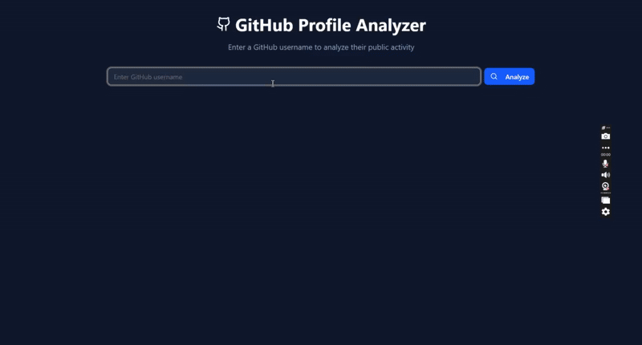

# 🚀 GitHub User Profile Analyzer

A sleek web application built with **ReactJS**, **TypeScript**, and **ShadCN UI** that allows users to search for a GitHub username and view:

- 📦 A list of their public repositories  
- 📊 A chart displaying their daily commit activity

---

## 🌐 Live Demo

👉 [Click here to try the app](https://github-profile-exxtract.onrender.com/)  
_(Replace this with your actual deployed link)_

---

## App Preview




## 🛠️ Features

- 🔎 Search GitHub users
- 📁 View list of public repositories
- 📈 Visualize commit activity with charts
- ⚡ Modern UI built using ShadCN & TailwindCSS
- 🧩 Fully responsive and fast

---

## 🧑‍💻 Technologies Used

- [React](https://reactjs.org/)
- [TypeScript](https://www.typescriptlang.org/)
- [ShadCN UI](https://ui.shadcn.dev/)
- [TailwindCSS](https://tailwindcss.com/)
- [Recharts](https://recharts.org/)
- [GitHub REST API](https://docs.github.com/en/rest)

---

## 💻 How to Run Locally (for non-technical users)

### 🧾 Prerequisites
Before you begin, make sure you have:
- [Node.js](https://nodejs.org/) (v16 or later)
- [Git](https://git-scm.com/) installed (optional, but recommended)

---

### 🪜 Steps

1. **Download the Project**
   - Click the green `Code` button on the top right of this page, then choose **Download ZIP**.
   - Extract the ZIP file to any folder.

2. **Open the Folder**
   - Open the extracted folder in a code editor like [VS Code](https://code.visualstudio.com/) or just your terminal.

3. **Install Required Files**
   Open a terminal in the folder and run:

   ```bash
   npm install
4. **Start the App**
   Once installation is done, start the development server:
   ```bash
   npm run dev
5. **View in Browser**
  http://localhost:5173